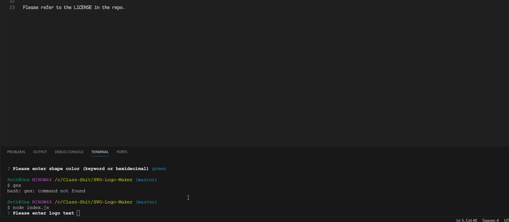

# SVG Logo Generator

## Description

A logo generator using the SVG filetype

## Installation

N/A

## Usage

Install Node.JS, then in your terminal navigate to the project folder and type "npm i -y" and then "node index.js"

## Credits

Coded By: Seth Correa (Seth the Furboi)

## License

Please refer to the LICENSE in the repo.